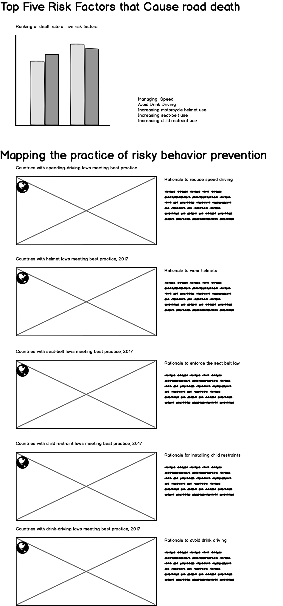

# Wirefames for user feedback
I created a prototype using **Basamiq** tool and decide to guide audience by steps how to map the inequality of road death step by step. Data resources and Agenda slide were not wireframed here due to time limit, and there are limited visual options to choose to from Basamiq, so I tryied to illustrate some of the visuals by text here. The main goal of the sketch is to walk through some interesting data stories with audience and call for action to raise the road safety awareness.

In the background slide(page 3), the downward errows are representing the SUDG Road death rate goal by 2020, unfortunately I failed to choose apporpirate icons to present that and it might casue confusion.

The message title in recommendation slide(page 8) should be "recommendation to improve th inequality of global road safety issue." The words are filtered somehow.

# User research protocol
In the first round of interview, I reached out to 5 students who are from different academic background(business/art management/data analystics/public policy/information systems). I listed my questions in [google form](https://docs.google.com/forms/d/e/1FAIpQLSchcYh5TmSVac6K1LurUegEFajmUXqztYK2rvhSyTf4ZAa-UQ/viewform?usp=pp_url) and created a review link of my wireframe, I waited for 24 hours to collect their responses. The questionaire involves three short answers and five long paragraohs. I translated some of the scripts first, then summarize key messages in a table.

|------:|:-----|---------|:------:|

## Takeaway One: It seems that readers are very clear about the purpose of presenting the story.
| Respondent| 1.What is the aim of the story?|
| -----------:|: ----------- :|
| A | To make the readers aware of road quality in different regions. |
| B | Discover the inequality of global road safe and give recommendations to improve road safety.|
| C | *For graduation:P* |
| D | Showing the differences across countries and time of road traffic safety |
| E | Inequality in road safety across regions and income groups|

## Takeaway Two: The graphs and message titles will inform audience with correct messages.
| Respondent| 2.Can you describe to me what the storyline is telling you?|
| ----------- :|: ----------- |
| A | The story first states the reality that road safety issue is becoming more and more important globally, then illustrates the relationship between road safety and countries' gpa index. What's more, the story points out that road traffic death situation is not the same among difference countries and their progress are not the same as well. Finally, it provides recommendations in terms of road safety issue. |
| B |道路安全是一个全球性的问题，在地域和收入水平间存在显著差距(Road safety issue is a global convern, it has significant difference across different regions and income levels)|
| C | It tells me which areas are better, the scatter plot describes the quality of roads, there is a trends graph showing the timeline etc. which is well made |
| D | While road safety has improved in some countries and regions, others have a ways to go.  |
| E | There is progress in road safety over. But less progress for some regions and income levels.|

## Takeaway Three: The content supports its title, however "Mapping" seem to be irrelevant to the topic unless you put a map to illustrate the changes of death rate by country.
| Respondent| 3. Assuming the content is complete and accurate, does the content (visualizations/text) support its title?|
| ----------- :|: ----------- |
| A | Yes.|
| B | The content can support its title.|
| C | it's pretty relevent.|
| D | Yes. Might be interesting to **include a map** if possible showing the differences in global road safety, maybe of road deaths per 100,000 people.|
| E | The content shows change in road safety among certain regions and income levels. **The word Mapping** doesnt convey the exact meaning.|

## Takeaway Four: Exploratory analysis is helpful to follow the logic, consider moving analysis 3 before 2.
| Respondent| 4.Does the storyline flow smoothly? (please provide the rationale of the logic flaw)|
| ----------- | ----------- |
| A | Yes, it starts from trends to the regions which face road quality issues and then goes to explain SDG goals and finally ends with recommendations.|
| B | It's smooth. It first tells the reader why road traffic issue is important and then, describe its current states using exploratory data analysis. This step make it easier to help the author and readers to find insights in the data. Finally it provide recommendations according to those insights.|
| C | The problem is very important: There is still wid gap between reality and goal -> Show the inequality phenomena between income level and regions -> Propose soultion).|
| D | Consider moving Analysis 3 (the scatterplot) to before Analysis 2 (the bar chart). It seems like you could show a wider view of each country's rate with the scatterplot, then zoom into a regional level and provide the "Interpretation of regional difference" after this.|
| E | Yes. An overview is given at first and then data is shown about how progress is not same across countries.|

## Takeaway Five: Change Typography to serious theme and readjust the font size, also remove extra icons in 5-7 pages.
| Respondent| 5. What do you think of the layout of the visuals?|
| ----------- | ----------- |
| A | It is good. Would look amazing with color.|
| B | The layout is good, but there are many unknown symbol in the last page and in 5/6/7 pages. The author should remove them with something meaningful and useful.|
| C | Very good!|
| D | love the neat layout, pretty cute font but not appropriate for such serious topic.|
| E | It looks good. The text is minimal.|

## Takeaway Six: Message titles should be more informative, previous exploratory analysis are not persuasive enough to make recommendations. 
| Respondent| 6. Do you think the storyline is persuasive enough?|
| ----------- | ----------- |
| A | Yes, it is a crucial and important topic that has been dealt well.|
| B | If I look into those pictures and data, they are persuasive, but they are not very straight forward. Those title should indicate the conclusions of the pictures, so that the readers can easily tell what you wanna see and what's your insights.|
| C | it's okay to present the seriousness of th problem between region and income level, however, it's not sufficient to suppor the conclusion in the last slide.|
| D | Yes|
| E | Yes|

## Takeaway Seven: There are multiple misunderstandings/mismatches between the visuals and titles in slide 3 to 7. Consider combining 2 and 3. Recommendation is not powerful enough-> Summary is more appropriate.
| Respondent| What're your recommendations to improve? (Please list the page)|
| ----------- | ----------- |
| A | Addition of color to initial graphs (page 2-3 I guess)|
| B | The author should include some colors in the graphs, so it will be more appealing.The author should replace the unknown symbols with words/graphs. The author should interpret the graphs a little besides the graphs. The author should fill the graphs with real data. The author should label the graphs.|
| C | "slide 3. ""Progress and SDG Goal Gap "": what is SDG? (I assume this slide used to support the severity o the problem, bu actually it was very vague, I suggest combining them into one slide. I thought you're presenting the positiv association between vehicle number and accidents rates.) (I suggest flipping the slide #5 and #6 to ensure the uniform sequence.)slide8.(Do we really need those recommendations? they are not persuasive enough to support your recommendation)|
| D | Just the map. Maybe it could go after Analysis 1|
| E | 1.Not sure what the Progress in slides 3-6 mean. Is it improvement or the current status? Progress gives positive notation while the visuals communicate negative.2. Slide 7 could improved. Not sure how 3 the visual is apt for showing 3 country's status.3. In slide 3, it doesnt differentiate which line belongs to SDG goal and progress. 4. Should legends be included for each graphs?"|

## Takeaway Eight: Consider mappin the top 10 reasons fo traffic death in the world and map road conditions would be useful to comprehend the topic in depth. 
| Respondent| 8. Is there any additional information you would like to know?|
| ----------- | ----------- |
| A | Maybe using a map to highlight the regions with type of road quality (like a heatmap) may prove to be useful. |
| B | I want to know the top ten reasons for traffic death in the world. It would be helpful to give recommendations.|
| C | You need other supportive evidence added before recommendation page|
| D | Not that I can think of now.|
| E | No.|

## Summary of the reveiw feedbacks
+ Aim:  Most readers understand highlighting the discrepencies in road safety issue betwen low,middle and high-income countries. Specifically, there appears to be a heterogeneous development between different groups of countries regarding road safety issues. 
+ Background: People found it confusing about "SDG goal" and they would love to know what the current SDG goa is and how the actual figures realte to this goal. Also, it might be good to add a trendline in the graph to visualize the progress if there's any. There's copy and paste error on the tracker that is misleading. If death rate decreases with GNI per capita, it's might be a good idea to add trendlines to support the message of the graph.
+ Summary: Move slide 7 before slide 4 might be a good idea if I want to show the results of the study first.
+ Recommendation: progress is not uniform, but what does it imply to policy makers if they really want to make changes. Incorporating a specific action would make the storyline more convincing.

# Revised wireframes

[Go back to main page](/README.md)
