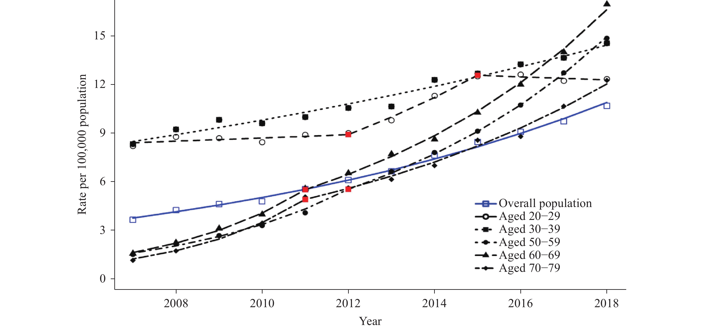

# Wireframe Phase 
## Here is my first attempt of solution
According to my assessments, I think there are three aspects for line charts to improve:
- Intuitivity:
..Use legends of contrast color to categorize different age groups...
..Add message titles and notes to impress readers with limited epidemic knowledge...

- Perceptibility:
..I would differentiate the older adults with the teenage HIV/AIDS incidence rates...
..Highlight the focus groups (older adults)and add trend line of all population rates..

- Engagement:
..Just for experiemental phases but I would make animation on my plot so that it can move across time...

## Here is my second attempt of solution
After the first round feedbacks from my friends, I decide to make some necessary changes to my line charts:
- I put the intepretation of death per population as my subtitle and change the age group 15-49 to be more reasonable.
- I change the verticle solid gridlines into dashed horizontal gridlines.
- I add a toolip to demonstrate the detailed statistics of each year by different age group.
- Highlighted the older adults group and use red and green to categorize them.

# Test the solution Phase
I conducted two rounds of interviews from three reliable friends: Jimmy, Andie and Yang. I really appreciate their high-quality and useful feedbacks. Here are some comments and suggestions, I found their perspectives are quite different from my view. For example, Jimmy is really picky about my message titles and he really want my title stand out. I rarely notice that.

## Feedback from first attempt
- Context: 
> clear titles but lacking detailed information: what does "death per 1000,000" mean? (Jimmy)
> It doesnot make sense that people who age between 15-49 has the lowest incidence death rate! (Andie)
> I understand this is trend analysis, but where is your x-axis label? (Yang)

- Layout:
> It's better to use curve line rather than regression plot.(Andie)
> The x and y axis is not necessray but the gridlines should be added so people can compare the death rates across years.(Yang)
> Maybe change the color because they are a bit cheerful...The intended audience are patients and researchers.(Jimmy)

## Feedback from second attempt
- Context: 
> Why not change titles into “older generation has higher HIV/AIDS incidence death risks”?  (Jimmy)
> It's easier to understand your illustration than last time from the legends. (Andie)
> I understand this is trend analysis, but where is your x-axis label? (Yang)
           
- Layout:
> Put the explanation of death rates in the notes below the charts (Andie)
> I really like the current layout, you can add add line symbols to specify the start and end point if you like.(Jimmy)
> I found it confusing about the "all population line" Is that a trendline or an indicator, I think they should be different from other line type. (Yang)

# Recreated data visualization Phase
When I downloaded the raw dataset from the Global Health Data Exchange Database (http://ghdx.healthdata.org/gbd-results-tool) I found that my critique visualization only extracts partial data, for example, they have comprehensive datasets form 1991 to 2017, and by country and gender. But my selected visualization only presents it in a 12-year span. They have other indicators such as incidence cause, location and measure. I decide to choose the death rate by different age group as my recreation. 

## Process of resdesigning
+ I read the article of HIV/AIDS incidence trend in China and realize the importance of stengthening importance of HIV/AIDS prevention and treatment of older adults. Older adults are often less educated and have not been the target populations for long-term HIV/AIDS control and prevention efforts in China. The results were consistent with other studies about the higher risk of HIV/AIDS among older adults at the national, provincial, and local levels in China. So I decide to deliver the message in my recreation of the line graph and highlight the targe population incidence death rate.

+ To improve the intuitiveness and aethetics, I replaced the line type from circleed dash lines to colored solid lines, and use dash lines to represent the trend line (overall population rates). I also change the message title and legends to be more informative and specified the statistics of given year. To make the graph easily understood, I added notes to explain what does death rate per 100,000 population means. below the graph, and cited the reference and date. The furthe feedbacks from my friends suggest that the gridlines are not necessary in this plot so I only keep the label bar in grey and  filled areas of high-risk population in grey. 

## Takeaway from the Observations
+ We can find that the The annual death rates of diagnosed HIV/AIDS among total population is increasing in China, yet HIV/AIDS in older adults has received little attention.There is sharp increases in modeled rate of HIV were observed among female aged 50–59 years and 60–69 years, as well as male aged 60–69 years and 70–79 years. Significant differences in changing trends and patterns of death rates HIV/AIDS were found among different age groups, especially between young adults and old adults. The annual average rates in children aged 5-14 years remained constant and the lowest across other age groups, the death rates of chidlren under five is also decreasing, which indicates the successful prevention of maternal infection. 

+ When I wireframe my solution. [Visualizing Health Wizard](http://www.vizhealth.org/wizard/) give me many hints and guidance of my communication needs, I figure out my primary goal is to increase the awareness of a risk but not necessrily change people's concern. For the level of understanding I will provide detailed number, then I found a straightforward multiple line graph showing the risk levels over time. It uses color cues to focus attention on the high-risk problem, but it also fairly sibtle point icons to distinguish which risk respond to which diesease. I will apply the similar strategy to add point icons in my curved line graphs and use bright colors to highlight the older adults risks, green to low risk population such as children and teenagers.

## A Future Improvement
My friends' feedbacks are really helpful in terms of overall layout design and color choice. They also provides me some further improvement such as adding animation in my graph like [Gapminder](https://www.gapminder.org/tools/#$chart-type=linechart)did. I think it is a great idea to present and I can use different groups to show the time lines. Unfortunately I was not able to share publically because I fail to embed my code in Github, so I found a demo that illustrate my future steps: those lines represent different age groups, the animation will display the changes of incidence death rates.

<iframe src="//www.gapminder.org/tools/?embedded=true#$chart-type=linechart" style="width: 100%; height: 500px; margin: 0 0 0 0; border: 1px solid grey;" allowfullscreen></iframe>

## Redeisgn and Original Version
+ My redesigned visualization shows the trend of HIV/AIDS death rates of 12 years, some age groups went down wheras some increase significantly, which make health care workers and patients concern. I didnot inlcude the regression analysis points exists in the original graph because they are modeled incidence rates, and they are convincing enough to illustrate my message that oleder people need more education and prevention care. I hope the revised graph can invite more audience to examine the information and digest the important message, not only for researchers, but also people who are interested in HIV/AIDS prevention topic. They can spend more time to identifying the trend and share it with other non-professionals, and they are accurate and precise data ready to be furthe analyzed. 

<iframe title="Chinese Older adults has higher HIV/AIDS death risks&amp;nbsp;" aria-label="Interactive line chart" id="datawrapper-chart-NMHG7" src="//datawrapper.dwcdn.net/NMHG7/1/" scrolling="no" frameborder="0" style="width: 0; min-width: 100% !important; border: none;" height="454"></iframe>

Versus original version:

[Go back to main page](/kaiqingy_repository.md)

