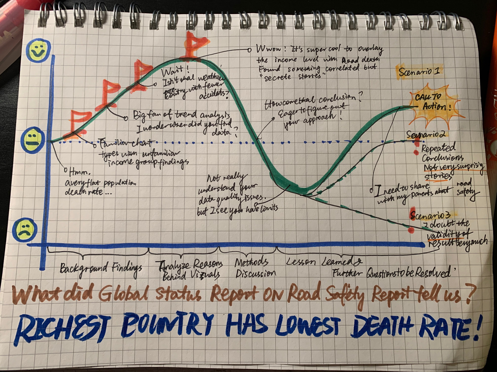
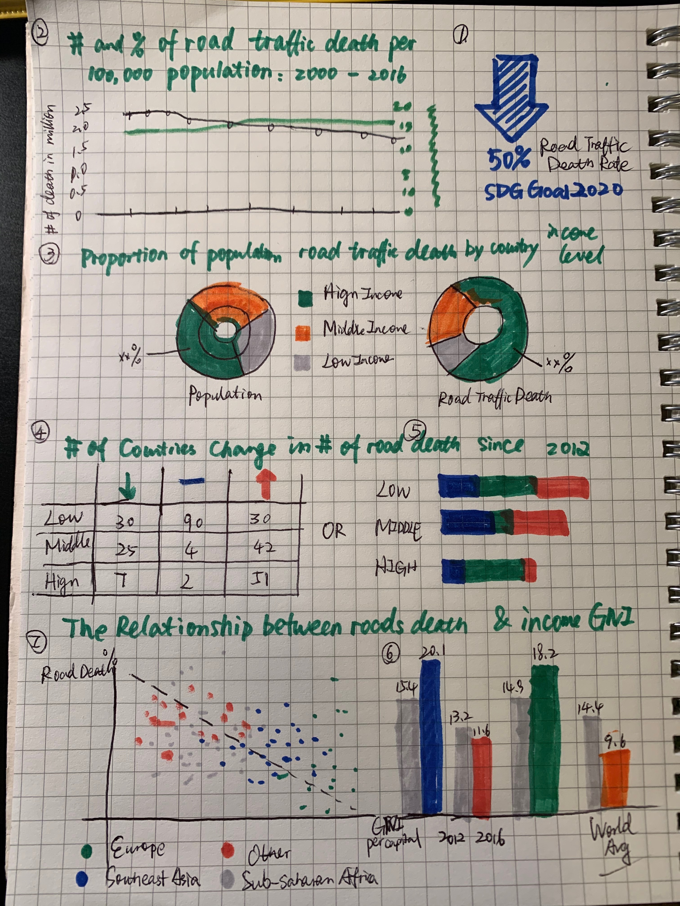

# Project Outline
I am interested in mapping global annual road traffic death statistics to discover the regional pattern with income level. Whether wealthier countries higher death rates? Or vice versa?

## Project Structure
+ Middle crisis: the global burden of road traffic deaths
  Summary statistics of overview of global trend of death on world's road to place our assumption.
+ Rising Action
  Investigate the correlation of income level and traffic death rate and figure out the regional characteristic. and death user type
+ Climax
  Summarize the findings and analyze the reasons behind the visualiztion
+ Falling Action
  Methodologies discussion and data collection
+ Denouncement
  lingering questions to be resolved

## Story Arc
  Further details of users stories please see the sory arc chatbox.
  
  
## Call to reaction
As a reader, I want to understand the reasons of motorization of transport so that I can take care of myself and other people around me. I can reduce the motorization rate by refusing drunk driving, adolescent driving and slowing speed.

## User stories
I expect when audience first see the message title: Richer countries have lower traffic death rates they would question the findings themselves. The best scenario is without any bias when they observe the yearly death rate trend line is flat, which invites audience to discover the stories themselves: the death rate is stable but the population rise these years, what has  happened? That's where users' interest climb up while I split up the yearly trend and expand investigation by different income level, regions and death user type. It will reveal more interesting stories and audience appetit reach to the climax: Then I will reveal the rationale behind that and summarize some interesting and general rules. Furthermore, I will take some outlier countries for further illustration. After the most exciting and informative part, the visualization should take a break and mythodologies and limitation should be covered here to deepen the audience's understanding to the dataset. I would assume there's a huge drop in concentration but we will embrace the wrap up soon -> Call for attention: Negative correlation and some useful tips to reduce traffic injuries. Other expected scenarios could happen if audience don't find the conclusive speech impressive or insightfu. But the ups and downs are necessary to describe the feedback between users and presenters. In the end the curve graph as illustrated in Arc story above is an expected user stories graph.

# Initial Sketches

We've explored how sketching can be a great way to help solidify your ideas into design choices, and for your proposal you'll be creating sketches that outline your initial thoughts for your final project.  You may choose to present your sketches and integrate them into Part I of your final project in whatever fashion you feel makes the most sense - but they should be clear enough to be understandable to someone that has little to no contextual background for your project.  Your sketches should mimic aspects of your outline, and build on the resounding message you want to make clear through your project.  Build in elements of your anticipated story structure for your project.  Your sketches themselves do not have to be visually correct / accurate and you may use whatever method makes the most sense to you (hand-drawn, digital, etc). 

# Data Source
+ the data source I found in world bank World Development Indicators. https://databank.worldbank.org/source/world-development-indicators/preview/on#advancedDownloadOptions I selected the following indicators in my dataset.
 
 1)All countries with low, middle and high income level 
 2)Population numbers for 2016 for selected countries 
 3)Reported number of road traffic deaths in 2016 for selected countries 
 4)Estimated road traffic death rate per 100,000 populationd from 2007 to 2016
 5)GNI per capita rom 2007 to 2016 in US dollars

+ I cleaned the dataset and deleted some countries with NA values, there are in total 175 countries with valid information within the 10-year span. The cleaned spreadsheet is available at https://drive.google.com/file/d/1KNWL02IEqn2hpmFgW0cvBGQ-HLRoOYau/view?usp=sharing. Some indicators such as estimated road traffic death and income level were updated according to 2018 newly released Global Status Reporat on Road Safety. WHO is an additional scientific source to extract the useful information and give clear definition of each indicator. https://www.who.int/violence_injury_prevention/road_safety_status/2018/en/ Here are some notes for indicators selection:

+ The reason why I prefer GNI instead of GDP index to evaluate the income level using the data from WHO because GNI measurs income whereas GDP measure production, therefore, Gross Net Income is more accurate in assessing a country's income level.
+ World Development Indicators database specified the income level lower bound: Low income is $1 005 or less, middle income is $1 006 to $12,235, high income is $12,236 or more. 
+ Some countries' 2016 data not available. Latest available source used from World Development Indicators database.

# Method and medium
For the lightning summary block, I will breifly talk about how do I build my stories using the data from World Bank and How do I come up with the data chart types. I will use short hand to present the what, why and how part in 50 seconds, and the last 10seconds represent interactive dashboard using Tableau. It should not exceed four-five pages.

For the final project, I will still consider using Shorthand platform to present my idea, but this time I will spend more time on illustration of exploring the data, interesting findings, rationale behing the visualization and takeaways from the analysis and future questions. At the same time I will document my data quality issues, initial sketch, peer evaluation, visualization process and interesting/doubtful findings on my Github repostory as a blog for future reference.

[Go back to main page](/kaiqingy_repository.md)

